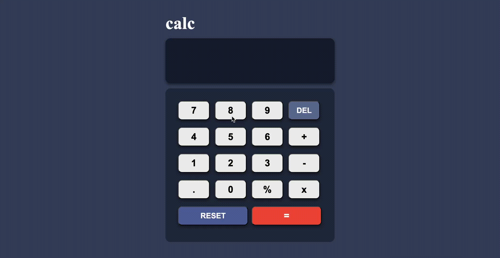

# Calculator App

A simple, functional calculator app built using HTML, CSS, and JavaScript. This project was created as part of **Micro Project 3**, and it mimics the design and functionalities provided in a Figma design reference. The calculator allows users to perform basic arithmetic operations such as addition, subtraction, multiplication, and division, with extra functionality for deleting the last character and resetting the display.



## Table of Contents
- [Features](#features)
- [Technologies Used](#technologies-used)
- [Setup](#setup)
- [Usage](#usage)

## Features
- **Basic Arithmetic**: Perform addition, subtraction, multiplication, and division.
- **DEL Button**: Deletes the last character in the input field.
- **RESET Button**: Resets the calculator's display to "0".
- **Real-time Calculation**: Evaluate mathematical expressions using the `=` button.
- **Responsive Design**: The layout is responsive, ensuring proper display on different screen sizes.

## Technologies Used
- **HTML5**: For structuring the UI with semantic tags.
- **CSS3**: For styling the calculator interface.
- **JavaScript (ES6)**: To implement calculator logic and interactions.
- **Figma**: The design was referenced from a Figma file.

## Setup
Follow these steps to run the calculator app locally on your machine:

1. **Clone the repository:**
   ```bash
   git clone https://github.com/your-username/calculator-app.git

2. **Navigate to the project directory:**
    ```bash
    cd calculator-app
3. **Open index.html in your browser: You can directly open the index.html file or use a simple HTTP server to run it.**

4. **Usage:**
    - **Click on the number buttons to input values.**
    - **Use operators +, -, *, and / for arithmetic operations.**
    - **DEL button removes the last input character.**
    - **RESET button clears the entire input and resets the display to "0".**
    - **= button evaluates the current expression and displays the result.**
